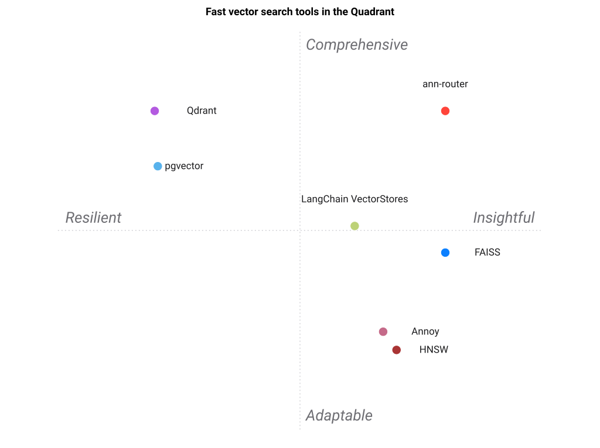

# Landscape

[🇫🇷](PAYSAGE.md)&nbsp;&nbsp;|&nbsp;&nbsp;[🇬🇧](LANDSCAPE.md)

How `ann-router` compares to *just picking one engine*. Each tool is rated on
**this project's job — selecting the right ANN backend from measured criteria** —
not penalised for excelling at a different job (serving one engine well).

## Positioning

`ann-router` does not compete with FAISS, HNSW, Qdrant or the rest — it
**orchestrates** them. They solve *indexing and serving*; ann-router solves
*which one to use, and why*. The closest analogue is not another vector library
but its own sibling [best-engine-ai-helper](https://github.com/warith-harchaoui/best-engine-ai-helper), which routes over LLMs.

## At a glance

| Fast Vector Search Tool | Measured selection | Justified rationale | Multi-engine | Handles churn | Metadata filter | Persistence | Recall-tested router | GPU acceleration | Vector compression | Distributed scaling | Managed cloud |
| --- | --- | --- | --- | --- | --- | --- | --- | --- | --- | --- | --- |
| **ann-router** | ⭐⭐⭐⭐⭐ | ⭐⭐⭐⭐⭐ | ⭐⭐⭐⭐⭐ | ⭐⭐⭐⭐ | ⭐⭐⭐⭐ | ⭐⭐⭐⭐ | ⭐⭐⭐⭐⭐ | ⭐⭐⭐⭐ | ⭐⭐⭐⭐⭐ | ⭐⭐⭐ | ⭐⭐ |
| **FAISS** | ⭐ | ⭐ | ⭐ | ⭐⭐ | ⭐ | ⭐⭐ | ⭐⭐ | ⭐⭐⭐⭐⭐ | ⭐⭐⭐⭐⭐ | ⭐⭐ | ⭐ |
| **HNSW** | ⭐ | ⭐ | ⭐ | ⭐ | ⭐ | ⭐ | ⭐ | ⭐ | ⭐ | ⭐ | ⭐ |
| **Annoy** | ⭐ | ⭐ | ⭐ | ⭐ | ⭐ | ⭐⭐ | ⭐ | ⭐ | ⭐⭐ | ⭐ | ⭐ |
| **Qdrant** | ⭐ | ⭐ | ⭐ | ⭐⭐⭐ | ⭐⭐⭐⭐⭐ | ⭐⭐⭐⭐⭐ | ⭐ | ⭐⭐⭐⭐ | ⭐⭐⭐⭐⭐ | ⭐⭐⭐⭐⭐ | ⭐⭐⭐⭐⭐ |
| **pgvector** | ⭐ | ⭐ | ⭐ | ⭐⭐⭐ | ⭐⭐⭐⭐⭐ | ⭐⭐⭐⭐⭐ | ⭐ | ⭐ | ⭐⭐⭐ | ⭐⭐⭐ | ⭐⭐⭐⭐⭐ |
| **LangChain VectorStores** | ⭐⭐ | ⭐ | ⭐⭐⭐⭐ | ⭐⭐ | ⭐⭐⭐ | ⭐⭐⭐ | ⭐ | ⭐⭐ | ⭐ | ⭐⭐⭐ | ⭐⭐⭐ |

(A single engine scores ⭐ on "measured selection" because it *is* the selection —
there is nothing to decide. That is the point ann-router addresses.)

## Per-tool write-up

### FAISS
The scale king: IVF + PQ + GPU handle billions of vectors. But it is a *library*,
not a decision — its recall collapses on small or near-orthogonal corpora (the
`roitelet` study measured FAISS-HNSW recall ~0.47 at N=5k), it has no metadata
filtering, and choosing IVF vs Flat vs PQ and their parameters is exactly the
work ann-router automates. ann-router routes **to** FAISS for the very-large +
GPU/batch regime where it wins.

### HNSW (hnswlib)
Best recall/latency in memory for a **stable** corpus. Deletes are tombstone-only
(the graph degrades), so it is wrong for churny data — ann-router sends those to
turbovec instead, and reaches for HNSW as the high-precision in-memory default.

### Annoy
Frozen, memory-mapped, wonderfully lean for a **read-only** corpus under tight
memory. Cannot add or remove at all (ann-router surfaces this as `NotSupported`).
The right tool for exactly one regime — which ann-router detects.

### Qdrant / pgvector
The persistence + metadata-filter answer: on-disk HNSW plus payload/SQL `WHERE`
filtering. Heavier to operate than an in-memory index, so ann-router routes here
only when the criteria actually ask for filtering or durability — preferring
pgvector when a Postgres already exists.

### turbovec
The dynamic-corpus specialist: O(1) add/remove and 2-4 bit TurboQuant (~16×)
compression, strong on Apple Silicon. Recall is data-dependent (quantisation is
lossy), so ann-router picks it for the *frequent-updates* branch, not for
maximal-recall static workloads.

### LangChain VectorStores
A broad adapter layer over many stores — closest in spirit — but it unifies
*APIs*, not *decisions*: it will happily let you pick the wrong store. ann-router
adds the measured selection + justification + recall-tested policy on top.

## The thesis

Marrying one engine optimises for one shape of problem. Real systems change
shape — they grow, they start needing deletes, they add a filter requirement, they
move to a box with a GPU. ann-router keeps the *interface* fixed and lets the
*engine* follow the measured problem, with a rationale you can read and override.
