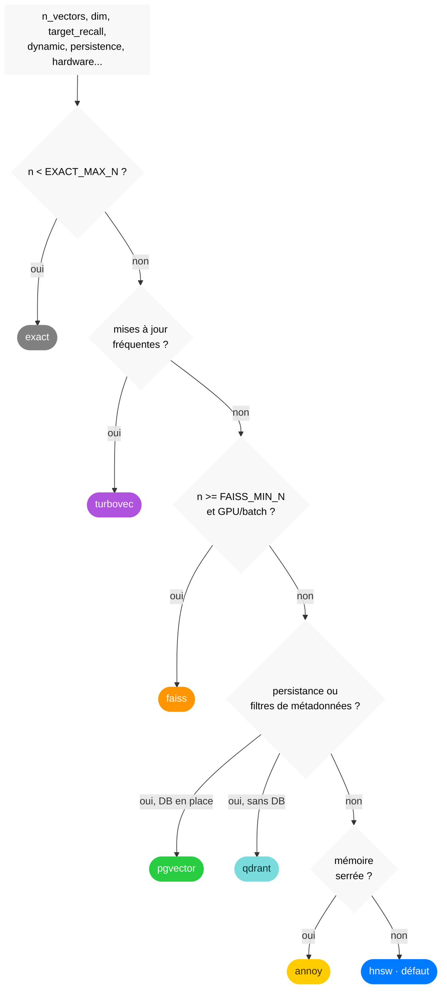

# ann-router


[🇫🇷](https://github.com/warith-harchaoui/ann-router/blob/master/LISEZMOI.md)&nbsp;&nbsp;|&nbsp;&nbsp;[🇬🇧](https://github.com/warith-harchaoui/ann-router/blob/master/README.md)


[](https://github.com/warith-harchaoui/ann-router/actions/workflows/tests.yml)

`ann-router` fait partie de la suite **AI Helpers**. C'est un *routeur* :
vous décrivez votre problème de recherche de plus proches voisins approchés
(ANN) en termes *mesurés* et il sélectionne, **justifie** et peut **instancier**
le bon moteur, au lieu de vous marier à une seule bibliothèque.

Rechercher les vecteurs les plus proches d'un vecteur de requête dans une base de nombreux vecteurs est un problème très courant en intelligence artificielle. Naïvement le problème a une complexité linéaire en le nombre de vecteurs dans la base. Souvent ce n'est pas acceptable donc on fait une recherche approchée pour avec une complexité beaucoup plus faible en le nombre de vecteurs dans la vase et raisonnable pour nos applications à millions voire milliards de vecteurs.

**C'est un composant indispensable pour les RAG.**

C'est le pendant « recherche vectorielle » de
[`best-engine-ai-helper`](https://github.com/warith-harchaoui/best-engine-ai-helper)
(qui choisit le meilleur LLM local pour une machine).

Même philosophie :
**mesurer les critères → choisir le moteur → renvoyer une justification
discutable.**

Les moteurs entre lesquels il arbitre :

> **naïf, exact (force brute) · turbovec · HNSW (hnswlib) · FAISS (IVF/PQ) ·
> Annoy · Qdrant · pgvector**

(ScaNN a été évalué puis abandonné : aucun wheel Apple Silicon n'existe et le
projet l'a définitivement abandonné comme backend supporté — voir
[CHANGELOG.md](https://github.com/warith-harchaoui/ann-router/blob/master/CHANGELOG.md).)

Importer le paquet est peu coûteux et sans dépendance : aucune dépendance
optionnelle de moteur n'est chargée à l'import, donc `import ann_router`
fonctionne avec numpy seul et un backend dont la dépendance est absente se
signale simplement indisponible pendant que le routeur le contourne. Il s'agit donc de _lazy import_.

## Pourquoi router plutôt que choisir FAISS d'office (ou un autre) ?

Parce que le bon moteur est une *fonction du problème* et le problème change :
un corpus de 5 000 vecteurs veut un balayage exact (instantané, rappel 1.0) ;
un corpus avec insertions/suppressions constantes veut turbovec (mutation
O(1)) ; un besoin de filtres SQL `WHERE` veut pgvector ; un corpus figé et
contraint en mémoire veut Annoy. Coder en dur une seule bibliothèque en réussit
un cas et rate les autres. Voir
[PAYSAGE.md](https://github.com/warith-harchaoui/ann-router/blob/master/PAYSAGE.md).

## Installation

### En local (conda)

Un `environment.yaml` minimal épingle Python + pip et délègue toute
dépendance réelle à `requirements.txt` :

```bash
git clone https://github.com/warith-harchaoui/ann-router.git
cd ann-router
conda env create -f environment.yaml
conda activate ann-router
pip install -e '.[all]'        # ou [hnsw]/[faiss]/... pour un seul moteur
```

### En serveur (Docker)

Une seule image construit tous les moteurs installables par pip plus la
porte API HTTP :

```bash
docker build -t ann-router .
docker run --rm -p 8018:8018 ann-router
curl -X POST localhost:8018/route -H 'content-type: application/json' \
    -d '{"n_vectors": 500000, "dim": 768, "dynamic": true}'
```

### pip simple

```bash
git clone https://github.com/warith-harchaoui/ann-router.git
cd ann-router
pip install 'os-helper'
pip install .
```

Ajoutez les moteurs au besoin (extras par backend) ou tout d'un coup :

```bash
pip install 'ann-router[hnsw]'      # un moteur
pip install 'ann-router[all]'       # tous les moteurs installables + cli + api
```

Les instructions complètes et spécifiques à la plateforme — dont la mise en
garde **annoy sur Apple Silicon** et les notes **pgvector** — sont dans
[INSTALL.md](https://github.com/warith-harchaoui/ann-router/blob/master/INSTALL.md).

## Démarrage rapide (bibliothèque)

```python
import numpy as np
import ann_router as ar

# 1. Décrire le problème en termes mesurés.
criteres = ar.Criteria(
    n_vectors=2_000_000, dim=768,
    dynamic=True,              # ajouts/suppressions fréquents
    target_recall=0.95,
    hardware=ar.detect_hardware(),
)

# 2. Demander quel backend — et pourquoi.
choix = ar.route(criteres)
print(choix.backend)          # 'turbovec'
print(choix.rationale)        # « le corpus reçoit des mises à jour fréquentes : ... »

# 3. Ou router + construire en un appel, puis chercher.
vecteurs = np.random.default_rng(0).standard_normal((5_000, 768)).astype("float32")
index, choix = ar.auto_index(vecteurs, ar.Criteria(n_vectors=5_000, dim=768))
ids, distances = index.search(vecteurs[:3], k=10)
```

Chaque backend parle la même interface `ANNIndex` :

```python
index.build(vecteurs, ids=None)
index.add(vecteurs); index.add_with_ids(vecteurs, ids); index.remove(ids)
ids, distances = index.search(requetes, k)
index.save(chemin); index.load(chemin)
Backend.capabilities()        # supports_remove / supports_filter / persistent / needs_gpu ...
```

Une opération qu'un backend ne peut réellement pas faire (ex. `Annoy.remove`)
lève un `NotSupported` clair ; un backend dont la dépendance manque lève un
`BackendUnavailable` avec la ligne `pip install` qui corrige.

## Les cinq portes (un cœur, cinq surfaces)

1. **Bibliothèque** — tout ce qui précède (`ann_router`).
2. **CLI** — `ann-router` (argparse, toujours disponible) et le jumeau
   `ann-router-click` (extra `[cli]`). Sous-commandes : `route`, `build`,
   `search`, `bench`, `capabilities`.
3. **API HTTP** — `uvicorn ann_router.api:app` (extra `[api]` ou l'image
   Docker ci-dessus) : `POST /route`, `GET /capabilities`, `GET /bench`.
4. **Serveur MCP** — `python -m ann_router.mcp_server` (extra `[mcp]`) : expose
   `route`, `capabilities`, `bench` comme outils d'agent.
5. **Skill** — `skills/ann-router/SKILL.md`, pour qu'un agent sache quand
   dégainer le routeur.

```bash
ann-router route --n-vectors 2000000 --dim 768 --dynamic --markdown
ann-router bench --n 5000 --dim 128 -k 10
ann-router capabilities
```

## Comment fonctionne la sélection

L'arbre de décision (réglable via `policy.yaml` / `ANN_ROUTER_POLICY`) :



| # | Si les critères disent… | Router vers | Parce que |
| - | ----------------------- | ----------- | --------- |
| 1 | `n < EXACT_MAX_N` | **exact** | un balayage force brute est déjà instantané et exact (rappel 1.0) |
| 2 | mises à jour fréquentes | **turbovec** | ajout/suppression O(1), sans reconstruction ; TurboQuant 2-4 bits (~16×) |
| 3 | `n >= FAISS_MIN_N` + GPU/batch | **FAISS** | IVF+PQ passe à l'échelle ; débit GPU par lots |
| 4 | persistance + filtres de métadonnées | **Qdrant / pgvector** | HNSW sur disque + filtrage payload/SQL `WHERE` |
| 5 | lecture seule + mémoire serrée | **Annoy** | figé, mappé en mémoire, très léger |
| 6 | corpus stable en mémoire (défaut) | **HNSW** | meilleur rappel/latence quand l'index change rarement |

`EXACT_MAX_N`/`FAISS_MIN_N` sont en cours de calibrage à partir de données
mesurées de rappel/latence plutôt que devinés — voir
[bench/README.md](https://github.com/warith-harchaoui/ann-router/blob/master/bench/README.md)
pour le balayage et
[bench/results/decision_tree.md](https://github.com/warith-harchaoui/ann-router/blob/master/bench/results/decision_tree.md)
pour l'arbre de ce projet avec les seuils actuellement mesurés, par dimension
d'embedding. Tant que ce calibrage n'est pas revu et appliqué à
`ann_router/policy.yaml`, le routeur en production route provisoirement tout
choix non-exact vers turbovec plutôt que de faire confiance à un seuil non
mesuré (voir `ann_router.policy.PROVISIONAL_ROUTING`) ; le tableau et le
diagramme ci-dessus sont la politique cible, pas nécessairement le
comportement actuel en production.

Le routeur renvoie non seulement le nom mais les **critères qui l'ont dicté** et
les **alternatives considérées** (y compris un moteur préféré mais non installé
dont il a dû se rabattre), pour que le choix soit auditable et surchargeable.

## Les critères (la spécification d'entrée)

`n_vectors`, `dim`, `target_recall`, `latency_budget_ms`, `memory_budget_gb`,
`dynamic`, `metadata_filtering`, `hardware` (`cpu`/`gpu`/`apple_silicon`,
auto-détectable), `persistence`, `batch_queries`, `metric`
(`cosine`/`l2`/`ip`). Seuls `n_vectors` et `dim` sont obligatoires.

## Pour aller plus loin

- [EXAMPLES.md](https://github.com/warith-harchaoui/ann-router/blob/master/EXAMPLES.md) — un livre de recettes exécutable.
- [PAYSAGE.md](https://github.com/warith-harchaoui/ann-router/blob/master/PAYSAGE.md) — comment ann-router se compare au choix d'un seul moteur.
- [CODING.md](https://github.com/warith-harchaoui/ann-router/blob/master/CODING.md) — le standard de code que ce dépôt s'impose.
- [bench/README.md](https://github.com/warith-harchaoui/ann-router/blob/master/bench/README.md) — le harnais de calibrage mesuré.
- [CONTRIBUTING.md](https://github.com/warith-harchaoui/ann-router/blob/master/CONTRIBUTING.md) · [CHANGELOG.md](https://github.com/warith-harchaoui/ann-router/blob/master/CHANGELOG.md) · [TRIGGERS.md](https://github.com/warith-harchaoui/ann-router/blob/master/TRIGGERS.md)

## Auteur

[Warith HARCHAOUI](https://harchaoui.org/warith), Ph.D.

## Licence

BSD-3-Clause — voir [LICENSE](https://github.com/warith-harchaoui/ann-router/blob/master/LICENSE).
