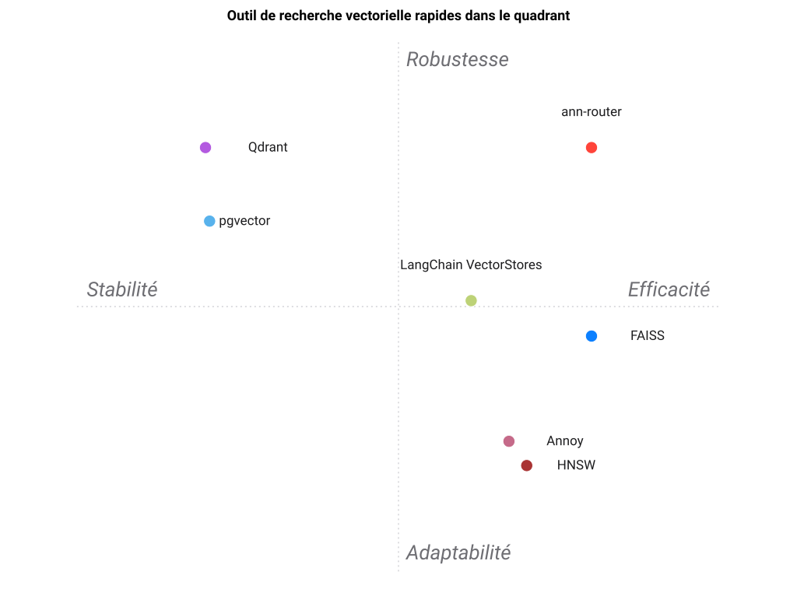

# Paysage

[🇫🇷](PAYSAGE.md)&nbsp;&nbsp;|&nbsp;&nbsp;[🇬🇧](LANDSCAPE.md)

Comment `ann-router` se compare au fait de *choisir un seul moteur*. Chaque outil
est noté sur **le travail de ce projet — sélectionner le bon backend ANN à partir
de critères mesurés** — sans être pénalisé pour exceller à un autre travail
(servir un moteur donné).

## Positionnement

`ann-router` ne concurrence pas FAISS, HNSW, Qdrant et les autres — il les
**orchestre**. Ils résolvent *l'indexation et le service* ; ann-router résout
*lequel utiliser, et pourquoi*. Son analogue le plus proche n'est pas une autre
bibliothèque vectorielle mais son propre frère `best-engine-ai-helper`, qui route
entre des LLM.

## En un coup d'œil

| Outil de recherche vectorielle rapide | Sélection mesurée | Justification | Multi-moteur | Gère le churn | Filtre métadonnées | Persistance | Routeur testé en rappel | Accélération GPU | Compression vectorielle | Passage à l'échelle | Cloud managé |
| --- | --- | --- | --- | --- | --- | --- | --- | --- | --- | --- | --- |
| **ann-router** | ⭐⭐⭐⭐⭐ | ⭐⭐⭐⭐⭐ | ⭐⭐⭐⭐⭐ | ⭐⭐⭐⭐ | ⭐⭐⭐⭐ | ⭐⭐⭐⭐ | ⭐⭐⭐⭐⭐ | ⭐⭐⭐⭐ | ⭐⭐⭐⭐⭐ | ⭐⭐⭐ | ⭐⭐ |
| **FAISS** | ⭐ | ⭐ | ⭐ | ⭐⭐ | ⭐ | ⭐⭐ | ⭐⭐ | ⭐⭐⭐⭐⭐ | ⭐⭐⭐⭐⭐ | ⭐⭐ | ⭐ |
| **HNSW** | ⭐ | ⭐ | ⭐ | ⭐ | ⭐ | ⭐ | ⭐ | ⭐ | ⭐ | ⭐ | ⭐ |
| **Annoy** | ⭐ | ⭐ | ⭐ | ⭐ | ⭐ | ⭐⭐ | ⭐ | ⭐ | ⭐⭐ | ⭐ | ⭐ |
| **Qdrant** | ⭐ | ⭐ | ⭐ | ⭐⭐⭐ | ⭐⭐⭐⭐⭐ | ⭐⭐⭐⭐⭐ | ⭐ | ⭐⭐⭐⭐ | ⭐⭐⭐⭐⭐ | ⭐⭐⭐⭐⭐ | ⭐⭐⭐⭐⭐ |
| **pgvector** | ⭐ | ⭐ | ⭐ | ⭐⭐⭐ | ⭐⭐⭐⭐⭐ | ⭐⭐⭐⭐⭐ | ⭐ | ⭐ | ⭐⭐⭐ | ⭐⭐⭐ | ⭐⭐⭐⭐⭐ |
| **LangChain VectorStores** | ⭐⭐ | ⭐ | ⭐⭐⭐⭐ | ⭐⭐ | ⭐⭐⭐ | ⭐⭐⭐ | ⭐ | ⭐⭐ | ⭐ | ⭐⭐⭐ | ⭐⭐⭐ |

(Un moteur unique obtient ⭐ en « sélection mesurée » parce qu'il *est* la
sélection — il n'y a rien à décider. C'est précisément ce que traite ann-router.)

## Fiche par outil

### FAISS
Le roi de l'échelle : IVF + PQ + GPU gèrent des milliards de vecteurs. Mais c'est
une *bibliothèque*, pas une décision — son rappel s'effondre sur des corpus
petits ou quasi-orthogonaux (l'étude `roitelet` a mesuré FAISS-HNSW à ~0,47 de
rappel à N=5k), il n'a pas de filtrage par métadonnées, et choisir IVF vs Flat vs
PQ et leurs paramètres est exactement le travail qu'ann-router automatise.
ann-router route **vers** FAISS pour le régime très-gros-volume + GPU/batch.

### HNSW (hnswlib)
Meilleur rappel/latence en mémoire pour un corpus **stable**. Les suppressions
sont par pierres tombales (le graphe se dégrade), donc inadapté aux données
mouvantes — ann-router les envoie plutôt vers turbovec, et garde HNSW comme
défaut haute-précision en mémoire.

### Annoy
Figé, mappé en mémoire, merveilleusement léger pour un corpus **en lecture
seule** à mémoire serrée. Ne peut ni ajouter ni supprimer (ann-router l'expose en
`NotSupported`). L'outil idéal pour exactement un régime — qu'ann-router détecte.

### Qdrant / pgvector
La réponse persistance + filtre de métadonnées : HNSW sur disque plus filtrage
payload/SQL `WHERE`. Plus lourds à opérer qu'un index en mémoire, donc ann-router
n'y route que lorsque les critères demandent réellement du filtrage ou de la
durabilité — en préférant pgvector si un Postgres existe déjà.

### turbovec
Le spécialiste du corpus dynamique : ajout/suppression O(1) et TurboQuant 2-4
bits (~16×), fort sur Apple Silicon. Le rappel dépend des données (la
quantification est avec perte), donc ann-router le choisit pour la branche
*mises à jour fréquentes*, pas pour le rappel maximal en statique.

### LangChain VectorStores
Une large couche d'adaptateurs sur de nombreux stores — le plus proche en
esprit — mais elle unifie des *API*, pas des *décisions* : elle vous laissera
volontiers choisir le mauvais store. ann-router ajoute par-dessus la sélection
mesurée + la justification + la politique testée en rappel.

## La thèse

Épouser un seul moteur optimise pour une seule forme de problème. Les vrais
systèmes changent de forme — ils grandissent, se mettent à avoir besoin de
suppressions, ajoutent une exigence de filtre, migrent vers une machine à GPU.
ann-router garde l'*interface* fixe et laisse le *moteur* suivre le problème
mesuré, avec une justification lisible et surchargeable.
