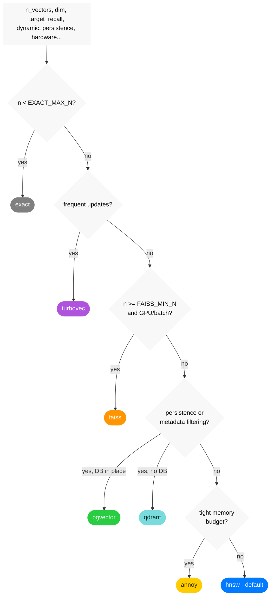

# ann-router


[🇫🇷](https://github.com/warith-harchaoui/ann-router/blob/master/LISEZMOI.md)&nbsp;&nbsp;|&nbsp;&nbsp;[🇬🇧](https://github.com/warith-harchaoui/ann-router/blob/master/README.md)


[](https://github.com/warith-harchaoui/ann-router/actions/workflows/tests.yml)

`ann-router` belongs to the **AI Helpers** suite. It is a *router*: you describe
your approximate-nearest-neighbour (ANN) vector-search problem in *measured*
terms, and it selects, **justifies**, and can **instantiate** the right engine,
instead of marrying you to a single library.

Finding the vectors closest to a query vector inside a large database of vectors
is a very common problem in artificial intelligence. Naively, it has linear
complexity in the number of vectors in the database. That is often unacceptable,
so we run an *approximate* search with far lower complexity in the number of
vectors — reasonable for our applications at millions, even billions, of vectors.

**It is an indispensable component for RAG.**

It is the vector-search sibling of
[`best-engine-ai-helper`](https://github.com/warith-harchaoui/best-engine-ai-helper)
(which picks the best local LLM for a machine).

Same philosophy: **measure the criteria → select the engine → return a
discussable rationale.**

The engines it routes among:

> **exact (brute force) · turbovec · HNSW (hnswlib) · FAISS (IVF/PQ) · Annoy ·
> Qdrant · pgvector**

(ScaNN was evaluated and dropped: no Apple-Silicon wheel exists, and the
project has abandoned it as a supported backend — see
[CHANGELOG.md](https://github.com/warith-harchaoui/ann-router/blob/master/CHANGELOG.md).)

Importing the package is cheap and dependency-free: no engine's optional
dependency is loaded at import time, so `import ann_router` works with only numpy
installed, and a backend whose dependency is absent simply reports itself
unavailable while the router routes around it — this is lazy importing.

## Why route instead of just picking FAISS (or any one engine)?

Because the right engine is a *function of the problem*, and the problem changes:
a 5k-vector corpus wants an exact scan (instant, recall 1.0); a corpus with
constant inserts/deletes wants turbovec (O(1) mutation); one needing SQL
`WHERE`-filters wants pgvector; a frozen, memory-tight corpus wants Annoy. Hard
-coding one library gets one of these right and the rest wrong. See
[LANDSCAPE.md](https://github.com/warith-harchaoui/ann-router/blob/master/LANDSCAPE.md).

## Install

### Local (conda)

A minimal `environment.yaml` pins Python + pip and delegates every actual
dependency to `requirements.txt`:

```bash
git clone https://github.com/warith-harchaoui/ann-router.git
cd ann-router
conda env create -f environment.yaml
conda activate ann-router
pip install -e '.[all]'        # or [hnsw]/[faiss]/... for one engine at a time
```

### Server (Docker)

A single image builds every pip-installable backend plus the HTTP API door:

```bash
docker build -t ann-router .
docker run --rm -p 8018:8018 ann-router
curl -X POST localhost:8018/route -H 'content-type: application/json' \
    -d '{"n_vectors": 500000, "dim": 768, "dynamic": true}'
```

### Plain pip

```bash
git clone https://github.com/warith-harchaoui/ann-router.git
cd ann-router
pip install 'os-helper'
pip install .
```

Add engines as needed (per-backend extras), or everything at once:

```bash
pip install 'ann-router[hnsw]'      # one engine
pip install 'ann-router[all]'       # every pip-installable engine + cli + api
```

Full, platform-specific instructions — including the **Apple Silicon annoy**
caveat and **pgvector** notes — are in
[INSTALL.md](https://github.com/warith-harchaoui/ann-router/blob/master/INSTALL.md).

## Quick start (library)

```python
import numpy as np
import ann_router as ar

# 1. Describe the problem in measured terms.
criteria = ar.Criteria(
    n_vectors=2_000_000, dim=768,
    dynamic=True,              # frequent adds/removes
    target_recall=0.95,
    hardware=ar.detect_hardware(),
)

# 2. Ask which backend — and why.
choice = ar.route(criteria)
print(choice.backend)         # 'turbovec'
print(choice.rationale)       # "corpus receives frequent updates: turbovec offers O(1) ..."

# 3. Or route + build in one call, then search.
vectors = np.random.default_rng(0).standard_normal((5_000, 768)).astype("float32")
index, choice = ar.auto_index(vectors, ar.Criteria(n_vectors=5_000, dim=768))
ids, distances = index.search(vectors[:3], k=10)
```

Every backend speaks the same `ANNIndex` interface:

```python
index.build(vectors, ids=None)
index.add(vectors); index.add_with_ids(vectors, ids); index.remove(ids)
ids, distances = index.search(queries, k)
index.save(path); index.load(path)
Backend.capabilities()        # supports_remove / supports_filter / persistent / needs_gpu ...
```

Operations a backend genuinely cannot do (e.g. `Annoy.remove`) raise a clear
`NotSupported`; a backend whose dependency is missing raises `BackendUnavailable`
with the `pip install` line that fixes it.

## The five doors (one core, five surfaces)

1. **Library** — everything above (`ann_router`).
2. **CLI** — `ann-router` (argparse, always available) and the `ann-router-click`
   twin (`[cli]` extra). Subcommands: `route`, `build`, `search`, `bench`,
   `capabilities`.
3. **HTTP API** — `uvicorn ann_router.api:app` (`[api]` extra, or the Docker
   image above): `POST /route`, `GET /capabilities`, `GET /bench`.
4. **MCP server** — `python -m ann_router.mcp_server` (`[mcp]` extra): the same
   `route`/`capabilities`/`bench` operations as the HTTP API, auto-exposed as
   MCP tools via [`fastapi-mcp`](https://github.com/tadata-org/fastapi_mcp) at
   `http://127.0.0.1:8019/mcp` (Streamable HTTP, not stdio).
5. **Skill** — `skills/ann-router/SKILL.md`, so an agent knows when to reach for
   the router.

```bash
ann-router route --n-vectors 2000000 --dim 768 --dynamic --markdown
ann-router bench --n 5000 --dim 128 -k 10
ann-router capabilities
```

## How selection works

The decision tree (tunable via `policy.yaml` / `ANN_ROUTER_POLICY`):



| # | If the criteria say… | Route to | Because |
| - | -------------------- | -------- | ------- |
| 1 | `n < EXACT_MAX_N` | **exact** | a brute-force scan is already instant and exact (recall 1.0) |
| 2 | frequent updates | **turbovec** | O(1) add/remove, no rebuild; TurboQuant 2-4 bit (~16×) |
| 3 | `n >= FAISS_MIN_N` + GPU/batch | **FAISS** | IVF+PQ scales; GPU batch throughput |
| 4 | persistence + metadata filters | **Qdrant / pgvector** | on-disk HNSW + payload/SQL `WHERE` filtering |
| 5 | read-only + tight memory | **Annoy** | frozen, memory-mapped, very lean |
| 6 | stable in-memory (default) | **HNSW** | best recall/latency when the index rarely changes |

Row 1's `EXACT_MAX_N` scales with `Criteria.latency_budget_ms`: a brute-force
scan's cost is ~linear in n for fixed dim, so a budget looser than the 10 ms
reference extends the exact/ANN crossover proportionally, and a tighter one
shrinks it — see `ann_router.policy.effective_exact_max_n`.

`EXACT_MAX_N`/`FAISS_MIN_N` are being calibrated from measured recall/latency
data rather than guessed — see
[bench/README.md](https://github.com/warith-harchaoui/ann-router/blob/master/bench/README.md)
for the sweep and
[bench/results/decision_tree.md](https://github.com/warith-harchaoui/ann-router/blob/master/bench/results/decision_tree.md)
for this project's own tree with the currently-measured thresholds filled in,
per embedding dimension. Until that calibration is reviewed and applied to
`ann_router/policy.yaml`, the live router provisionally routes every
non-exact pick to turbovec rather than trust an unmeasured crossover (see
`ann_router.policy.PROVISIONAL_ROUTING`); the table and diagram above are the
target policy, not necessarily today's live behaviour.

The router returns not just the name but the **criteria that drove it** and the
**alternatives it considered** (including any preferred-but-uninstalled engine it
fell back from), so the choice is auditable and overridable.

## Criteria (the input spec)

`n_vectors`, `dim`, `target_recall`, `latency_budget_ms`, `memory_budget_gb`,
`dynamic`, `metadata_filtering`, `hardware` (`cpu`/`gpu`/`apple_silicon`,
auto-detectable), `persistence`, `batch_queries`, `metric`
(`cosine`/`l2`/`ip`). Only `n_vectors` and `dim` are required.

## More

- [EXAMPLES.md](https://github.com/warith-harchaoui/ann-router/blob/master/EXAMPLES.md) — a runnable cookbook.
- [LANDSCAPE.md](https://github.com/warith-harchaoui/ann-router/blob/master/LANDSCAPE.md) — how ann-router compares to just picking one engine.
- [CODING.md](https://github.com/warith-harchaoui/ann-router/blob/master/CODING.md) — the coding standard this repo holds itself to.
- [bench/README.md](https://github.com/warith-harchaoui/ann-router/blob/master/bench/README.md) — the measured calibration harness.
- [CONTRIBUTING.md](https://github.com/warith-harchaoui/ann-router/blob/master/CONTRIBUTING.md) · [CHANGELOG.md](https://github.com/warith-harchaoui/ann-router/blob/master/CHANGELOG.md) · [TRIGGERS.md](https://github.com/warith-harchaoui/ann-router/blob/master/TRIGGERS.md)

## Author

[Warith HARCHAOUI](https://harchaoui.org/warith), Ph.D.

## License

BSD-3-Clause — see [LICENSE](https://github.com/warith-harchaoui/ann-router/blob/master/LICENSE).
