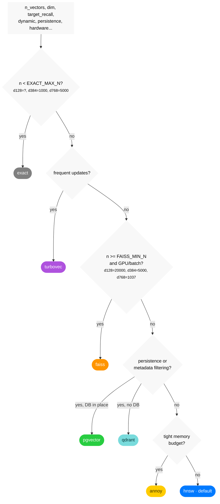

## Calibrated decision tree

Generated by `bench.calibrate` from `/Users/warithharchaoui/ann-router/bench/results/measurements.yaml` (491 measured cells). Diamond labels carry this run's measured thresholds, one value per dim.

